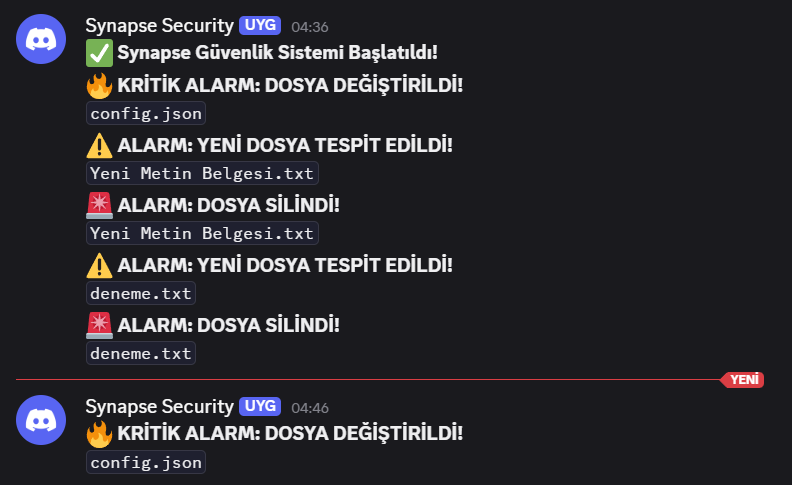

# 🛡️ SYNAPSE - File Integrity Monitor (FIM)


**Synapse**, a lightweight, zero-dependency **File Integrity Monitoring (FIM)** tool written in Python. It detects unauthorized file creations, modifications, and deletions in real-time using **SHA-256** hashing algorithms.

> 🎯 Designed for **Blue Team** operations, **SOC Analysts**, and **PCI-DSS** compliance monitoring needs.

---

## 📸 Screenshots

| **Real-Time Discord Alerts** | **Console Monitoring** |
|:---:|:---:|
|  |  |

*(Synapse sends instant notifications to your Discord channel via Webhooks when a file change is detected.)*

---

## 🚀 Features

* **🔎 Real-Time Monitoring:** Continuously polls critical directories for changes.
* **🔐 SHA-256 Hashing:** Uses cryptographic hashing to generate unique digital signatures.
* **⚡ Memory Efficient:** Implements **"Chunking" (4KB blocks)** to handle large files (GBs/TBs) without RAM overflow.
* **🔔 Discord Integration:** Sends detailed alerts to your Discord channel via Webhooks.
* **📦 Zero Dependencies:** Runs on standard Python libraries (`hashlib`, `json`, `os`, `urllib`). **No `pip install` required.**
* **⚙️ Configurable:** JSON-based configuration allows easy management.

---

Markdown

## 🛠️ Installation & Usage

### 1. Clone the Repository
Open your terminal and run the following commands:

```bash
git clone [https://github.com/SuatKoray/Synapse.git](https://github.com/SuatKoray/Synapse.git)
cd Synapse

2. Configure Settings
Rename config.example.json to config.json and edit it with your preferences.

JSON

{
    "monitor_path": ".",
    "file_extensions": [".txt", ".py", ".json", ".exe"],
    "webhook_url": "YOUR_DISCORD_WEBHOOK_URL_HERE",
    "monitoring_interval": 5,
    "log_file": "logs/synapse.log",
    "db_file": "data/baseline.json"
}

3. Run Synapse
Simply run the script with Python:

Bash

python main.py




🧠 How It Works
Baseline Creation: On the first startup, Synapse calculates SHA-256 hashes of all target files and saves them to a secure local database (data/baseline.json).

Continuous Polling: The system wakes up every X seconds (defined in config) to silently re-scan the directory.

Comparison Logic:

⚠️ New File: File exists in current scan but missing in baseline.

🚨 Deleted File: File exists in baseline but missing in current scan.

🔥 Modified File: Hash mismatch between baseline and current scan (Critical).

Alerting: If a deviation is detected, it logs to the console and pushes a payload to the Discord Webhook.

⚠️ Disclaimer
This tool is developed for educational and defensive purposes only. The developer is not responsible for any misuse of this software. Always obtain permission before monitoring systems you do not own.

📜 License
This project is licensed under the MIT License - see the LICENSE file for details.